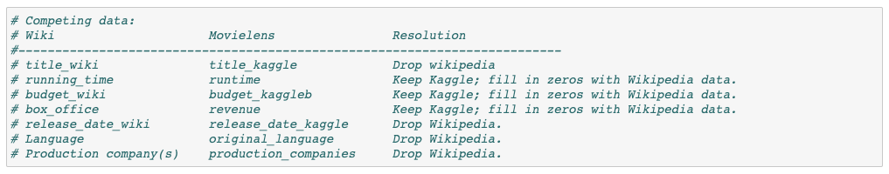

# Movies-ETL

## Overview
This project is focused on gathering public movie date from Wikipedia & Kaggle to perform an ETL. The goal was to extract this public information in order to clean & transform to utilize in a SQL database. 

## Results
### Wikipedia Data
This was provided a JSON file that needed to be transformed into a df. Once this data was created into a df, it was very apparent there were many unneccary columns of data that needed to be removed. Additionally, there were many inconsistencies in the data format for columns such as Box Office, Budget and Release Data. By utilizing regular expressions, I was able to reformat this data in a consistent format, so it would be easier to use later on.

### Kaggle Data 
The Kaggle Data was more consistent than the Wikipedia Data and required less work to transform. Small changes were made to clean any bad data, and to change the data format for a few columns. 

## Summary 
There was some overlap between both sources of data. By looking closer into the similar columns, we kept the Kaggle for all overlapping columns. We either dropped the Wikipedia data or used it to fill in for missing rows of data in the Kaggle Data. 

